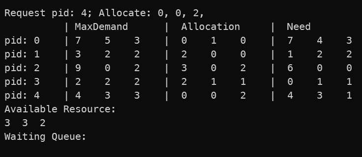

# 处理机调度：银行家算法

## 问题描述

银行家算法是避免死锁的一种重要方法，将操作系统视为银行家，操作系统管理的资源视为银行家管理的资金，进程向操作系统请求分配资源即企业向银行申请贷款的过程。

请根据银行家算法的思想，编写程序模拟实现动态资源分配，并能够有效避免死锁的发生。

## 实现要求

1. 对实现的算法通过流程图进行说明;
2. 设计不少于三组测试样例，需包括资源分配成功和失败的情况；
3. 能够展示系统资源占用和分配情况的变化及安全性检测的过程；
4. 结合操作系统课程中银行家算法理论对实验结果进行分析，验证结果的正确性；
5. 分析算法的鲁棒性及算法效率

## 实验环境

Windows OS；C# 10（.NET 6）

## 算法原理

### 进程申请资源

银行家算法中，申请资源时的算法流程图如下：

算法过程中，需要用到多个数据结构，记录资源分配情况：

- 可利用资源向量 `Available`：含有 m 个元素的数组，其中每个元素代表一类可利用资源的数目
- 最大需求矩阵 `Max`：行数为 n，列数为 m，表示 n 个进程的分别对 m 类资源的最大需求量
- 分配矩阵 `Allocation`：行数为 n，列数为 m，表示 n 个进程的分别对 m 类资源的已分配的数量
- 需求矩阵 `Need`：行数为 n，列数为 m，表示每个进程还需要的各类资源数。其中有数学关系：`Need[i,j] = Max[i,j] - Allocation[i,j]`

上图流程中的银行家算法，返回值有 3 种情况

- `Fail`：申请失败，说明要申请的资源数大于进程所需要的资源数，此时操作系统不予分配
- `Waiting`：申请失败，原因可能是当前资源暂时不够，也有可能是该请求可能造成死锁问题。但由于该请求是合理的，因此会将此时的请求存入进程请求队列，当资源充足时分配该请求
- `Success`：申请成功，此时资源充足且分配该请求不会造成死锁问题

为了充分模拟进程在计算机中分配资源的情况，我还建立进程请求队列 。当银行家算法返回 `Waiting` 时，将该请求加入进程请求队列中。

根据流程图，实现代码如下：

首先在试分配前，需要做一系列检查工作；并且经过银行家算法检查后，若进程请求需要等待，则需要将其加入进程请求队列中：

~~~C#
private AllocateStatus AllocateAfterFree(int processID, int[] requestVec, bool joinQueue = false)
{
    Console.Write($"Request pid: {processID}; Allocate: ");
    foreach (int r in requestVec)
        Console.Write($"{r}, ");
    Console.WriteLine();
    if (requestVec.Length != availableResource.Length)
        return AllocateStatus.Fail;
    if (processID < 0 || processID >= ProcessNum)
        return AllocateStatus.Fail;
    for (int i = 0; i < requestVec.Length; i++)
    {
        if (requestVec[i] > need[processID, i])
            return AllocateStatus.Fail;
    }
    for (int i = 0; i < requestVec.Length; i++)
    {
        if (requestVec[i] > availableResource[i])
        {
            if (joinQueue)
                processQueue.Enqueue(Tuple.Create(processID, requestVec));
            return AllocateStatus.Waiting;
        }
    }
    if (TryAllocate(processID, requestVec))  // 银行家算法安全性检查
        return AllocateStatus.Success;
    else
    {
        if (joinQueue)
            processQueue.Enqueue(Tuple.Create(processID, requestVec));
        return AllocateStatus.Waiting;
    }
}
~~~

上述代码中 `TryAllocate` 函数执行银行家算法安全性检查的步骤，具体如下：

~~~C#
private bool TryAllocate(int processID, int[] requestVec)
{
    for (int i = 0; i < requestVec.Length; i++)
    {
        availableResource[i] -= requestVec[i];
        allocation[processID, i] += requestVec[i];
        need[processID, i] -= requestVec[i];
    }
    int[] work = new int[availableResource.Length];
    Array.Copy(availableResource, work, availableResource.Length);
    bool[] finish = Enumerable.Repeat(false, ProcessNum).ToArray();
    bool findi;
    do
    {
        findi = false;
        for (int i = 0; i < ProcessNum; i++)
        {
            if (!finish[i])
            {
                bool flag = true;
                for (int j = 0; j < work.Length; j++)
                {
                    if (need[i, j] > work[j])
                    {
                        flag = false;
                        break;
                    }
                }
                if (flag)
                {
                    findi = true;
                    for (int j = 0; j < work.Length; j++)
                    {
                        work[j] += allocation[i, j];
                    }
                    finish[i] = true;
                    break;
                }
                else
                {
                    continue;
                }
            }
        }
    }
    while (findi);
    bool res = finish.All(b => b);
    if (!res)
    {
        for (int i = 0; i < requestVec.Length; i++)
        {
            availableResource[i] += requestVec[i];
            allocation[processID, i] -= requestVec[i];
            need[processID, i] += requestVec[i];
        }
    }
    return res;
}
~~~

### 进程释放资源

除了进程申请资源，还需要有进程释放资源的操作。进程释放资源的操作比较简单，只需要将指定 `pid` 的进程所持资源释放即可（也可以释放指定资源量）。然后在释放资源后，之前未成功分配的资源请求现在可能可以重新分配了，因此还需要对进程请求队列进行检查，从队列头往尾遍历，分配所有可以分配的请求，直到出现第一个无法分配的请求为止。

检查进程请求队列的代码如下

~~~C#
AllocateStatus res;
do
{
    res = AllocateStatus.Fail;
    processQueue.TryPeek(out var req);
    if (req != null)
    {
        res = AllocateAfterFree(req.Item1, req.Item2); // 尝试重新分配，使用银行家算法
        if (res == AllocateStatus.Success)
            processQueue.Dequeue();
    }
} while (res == AllocateStatus.Success);
~~~

## 实验测试

程序每次执行一次申请或释放，打印一次当前所有进程资源分配情况等的信息。

### 测试样例 1

可用资源数与各进程所需资源数，初始值如下：

首先依次执行如下操作：

- pid 0：申请资源 1,0,0
- pid 1：申请资源 4,1,1
- pid 2：申请资源 2,1,1
- pid 3：申请资源 0,0,2

这些申请操作都是合理的，不会导致死锁，且资源充足，此时资源分配情况如下：

接下来，执行操作：pid 0：申请资源 1,0,1

理论分析其是否安全：若将资源 1,0,1 分配给 pid 0，此时所剩资源为 1,1,1，pid 0 还需资源 1,2,1。观察 `Need` 矩阵，所剩资源不能满足任何一个进程的需求，可能发生死锁。因此当 pid 0 申请资源 1,0,1 时，系统不应该响应这个请求，而是应当将其放入进程请求队列中。

程序运行结果如下：

程序执行结果与预期相同，该请求被放入了消息队列中。

然后执行操作：pid 1：申请资源 2,0,2。该请求刚好满足 pid 1 的资源需求，允许分配。之后执行操作：pid 1：释放所有资源。释放资源后，操作系统需要重新去看进程请求队列中，按照次序是否存在可以分配的请求。通过观察知，进程 1 资源释放后，队列中的请求 (PID 0: 1,0,1) 可以被分配。

上述两个操作，程序执行结果如下：

程序执行正确。

### 测试样例 2

测试样例 2 来源于课件，具体如下。

可用资源数与各进程所需资源数，初始值如下：

依次执行如下操作：

- pid 0：申请资源 0,1,0
- pid 1：申请资源 2,0,0
- pid 2：申请资源 3,0,2
- pid 3：申请资源 2,1,1
- pid 4：申请资源 0,0,2

这些申请操作都是合理的，不会导致死锁，且资源充足，此时资源分配情况如下：

然后执行操作：pid 1：申请资源 1,0,2

理论分析其是否安全：若将资源 1,0,2 分配给进程 1，则剩余可用资源变为 2,3,0，进程 1 `Need` 变为 0,2,0。观察 `Need` 矩阵 ，此时资源还可以满足进程 1 的需求，存在安全序列 `P1, P3, P4, P0, P2`，说明分配该请求后仍然是安全的，允许分配。

程序执行结果如下：

### 测试样例 3

测试样例 3 在测试样例 2 的基础上做了些改动。

可用资源数与各进程所需资源数与样例 2 相同，前面的步骤也和样例 2 相同，依次执行如下操作：

- pid 0：申请资源 0,1,0
- pid 1：申请资源 2,0,0
- pid 2：申请资源 3,0,2
- pid 3：申请资源 2,1,1
- pid 4：申请资源 0,0,2

这些申请操作都是合理的，不会导致死锁，且资源充足，此时资源分配情况如下：

然后与样例 2 不同的是，这里执行进程 0 申请资源 1,0,2 的操作：pid 0：1,0,2

理论分析其是否安全：假设把资源 1,0,2 分配给进程 0，此时可用资源变为 2,3,0，进程 0 需求变为 6,4,1。观察 `Need` 矩阵，此时可用资源无法满足任何一个进程的需求，因此可能发生死锁。所以此时该请求不能被分配，应加入进程消息队列中。

程序执行结果如下：

然后执行操作：pid 0：4,0,0

由于此时资源数只有 3,3,2，第一项资源数不足 4，所以请求 4,0,0 失败，被加入进程请求队列中。

程序执行结果如下：

然后执行操作：pid 3：释放所有资源

进程 3 释放所有资源后，可用资源数变为 5,4,3，此时尝试分配进程请求队列中的请求。

首先是 pid 0: 1,0,2。假设分配，可用资源数变为 4,4,1，进程 0 的需求变为 6,4,1，此时可用资源数仍可满足进程 4 的需求，存在安全序列，因此允许分配。

然后是 pid 0: 4,0,0。假设分配，可用资源数变为 0,4,1，进程 0 需求变为 2,4,1，此时可用资源数无法满足任何 1 个进程的需求，因此可能死锁。不允许分配。

程序执行结果如下：

然后执行操作：pid 1：释放所有资源

进程 1 释放所有资源后，可用资源数变为 6,4,1。此时尝试分配进程请求队列中的请求 pid 0：4,0,0。假设分配，可用资源数变为 2,4,1，进程 0 需求变为 2,4,1，此时可用资源数满足进程 0 需求，存在安全序列，因此可以分配。

程序执行结果如下：

## 分析算法鲁棒性与效率

该算法的鲁棒性高，具体体现在：

- 对各种边界情况进行了判断：如判断进程请求资源数是否小于需求 `Need`；判断进程释放资源数是否小于已申请资源 `Allocation` 等
- 维护了进程请求队列，并在每次进程释放资源时，对队列从头往后进行检查，发现可以分配的请求则分配，直到遇到不可分配的请求为止。这一操作保证了请求队列的先入先出（FIFO）性质

算法复杂度上，主要关心银行家算法检测安全序列的步骤上，即代码中的 `TryAllocate` 函数上。考虑 `n` 个进程，`m` 种资源。由于该算法最坏情况下，要执行到所有进程的 `finish`都为 `true` 为止，即将所有进程都遍历一遍，复杂度 `O(n)`；每轮要搜索符合条件的进程 pid，需要一个循环，且之前搜到的进程不会被搜到，复杂度 `O(n/2)`；每次判断一个进程是否符合条件，要遍历所有资源数，复杂度 `O(m)`。总复杂度为：$O(n\times n/2\times m)$，即复杂度为 $O(mn^2)$。

## 思考题解答

### 银行家算法在实现过程中需注意资源分配的哪些事项才能避免死锁？

答：需要注意以下几点：

1. 保证初始值为安全状态。对于本次实验，我的初始值均为进程未被分配资源的状态，因此是安全的
2. 每次分配资源时，需要判断该次分配是否会进入不安全状态。即去寻找是否存在安全序列，若不存在，则此次分配可能引起死锁问题，该请求不应被即时响应
3. 进程申请的资源数不应大于其需要的资源数，或大于可用的资源数

## 文件说明

`BankerAlgorithm`：代码文件与解决方案

`publish`：发布的可执行程序

`testFiles`：测试样例

`run.cmd`：启动脚本

构建方式：用 VS 2022 打开 `BankerAlgorithm.sln` 进行编译；或通过命令行 `dotnet run BankerAlgorithm.sln`（请确保本机用 .NET 6 SDK）

程序启动时，通过命令行参数指定测试文件：`--fileName xxx`

测试文件格式如下：

- 第 1 行为进程资源数，用空格分隔
- 第 2 行空行
- 第 3 行到第 n 行为进程最大需求量，每行代表一个进程的最大需求资源数
- 第 n + 1 行空行
- 第 n + 2 行往后，代表每次申请的操作。程序初始化时，所有进程均未申请资源。操作的格式如下：
  - 申请资源：
    - `+ pid 申请资源向量`：`+` 代表申请；pid 为进程号，从 0 开始计数，到进程数减 1；申请资源向量用空格分隔
  - 释放资源：
    - `- pid`：`-` 代表释放资源；`pid` 代表进程号。该格式代表释放指定进程的占用的所有资源
    - `- pid 释放资源向量`：也可以通过指定释放的资源向量，来释放指定数量的资源

一个合法的测试文件如下：

~~~
9 3 6

3 2 2
6 1 3
3 1 4
4 2 2

+ 0 1 0 0
+ 1 4 1 1
+ 2 2 1 1
+ 3 0 0 2
+ 0 1 0 1
+ 1 2 0 2
- 1

~~~
